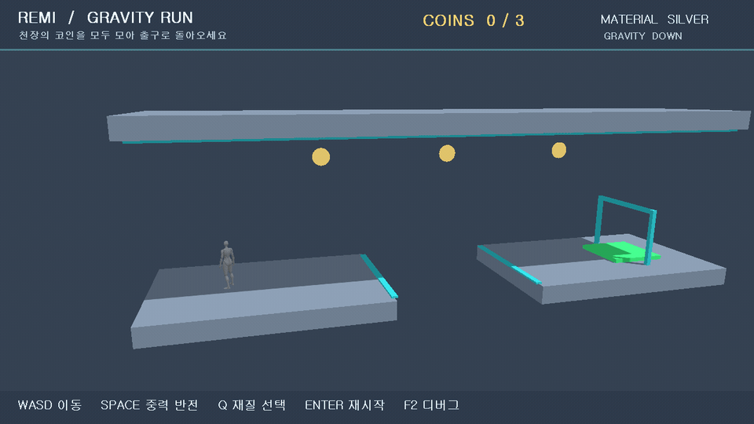

[한국어](README.md) · [日本語](README.ja.md) · [简体中文](README.zh.md)

# REMI Engine

**C++20 · DirectX 11 · HLSL · Windows x64**

REMI는 렌더링, 장면, 리소스, 물리, 수명 관리를 직접 구현하며 확장하는 소형 게임 엔진입니다. `REMIGravity`는 엔진으로 만든 중력 반전 퍼즐 데모입니다. 천장의 코인 3개를 모아 출구에 도착하는 플레이를 확인할 수 있습니다.



## 주요 기능

| 분야 | 현재 구현 |
| --- | --- |
| 렌더링 | D3D11 RHI 버퍼·텍스처·파이프라인·명령·오프스크린 타깃, 변경 감지 ShaderCache, Standard/Unlit/Toon 셰이딩, 방향광, 2048² shadow map과 3×3 PCF, static mesh 프러스텀 컬링 |
| 장면·리소스 | 계층 Transform, 세대 검증 EntityId, 핸들 기반 Mesh/파일 캐시 |
| 에셋·캐릭터 | 런타임 glTF/GLB 메시·기본색 텍스처·재질 임포트, `.remimat` 재질 파일, CPU 본 스키닝·클립 전환 상태 머신, 기존 RMCH 베이크 애니메이션 |
| 게임·진단 | AABB 물리와 중력 반전 데모, Pretendard HUD, CPU/GPU 시간 CSV, D3D debug layer 검사 |

현재 셰이더의 `metallic`·`roughness`는 **간이 조명 모델의 조정값**입니다. RHI가 리소스·드로 명령과 swap chain 표면을 담당하며, 기본 그림자 타깃·GPU 진단은 아직 D3D11 전용입니다. glTF 본 스키닝은 CPU에서 계산하며 PBR·IBL·GPU 스키닝·콘솔 지원은 아직 없습니다.

## 실행

Windows 10/11 x64, Visual Studio 2022의 C++ 데스크톱 도구와 Windows SDK, CMake 3.25 이상이 필요합니다.

```powershell
cmake --preset vs2022-x64
cmake --build --preset debug
ctest --preset debug
build\vs2022-x64\bin\Debug\REMIGravity.exe
```

`WASD` 이동, `Space` 중력 반전, `Q` 재질 프리셋, 우클릭 드래그 카메라 회전, 휠 확대/축소, `Enter` 재시작, `F2` 성능 표시, `F5` 셰이더 재로드, `Esc` 종료입니다. [gravity.project.json](games/gravity/gravity.project.json)에서 셰이더·캐릭터·폰트 경로와 주요 레벨/물리 수치를 바꿀 수 있고 `--project <파일>`로 다른 프로젝트를 실행할 수 있습니다. 파일의 상대 경로는 해당 프로젝트 파일의 폴더를 기준으로 해석합니다. 로컬 캐릭터 에셋이 없으면 박스 캐릭터로 실행됩니다. `--character <파일>`에 `.rmc`, `.gltf`, `.glb`를 지정할 수 있습니다. `--idle-clip <이름> --move-clip <이름>`으로 동작 이름을 선택하며, glTF는 이름이 없으면 Stand/Idle 및 Run/Walk를 찾아 사용합니다. 자세한 임포트 규칙은 [AssetPipeline](docs/AssetPipeline.md)에 있습니다.

Release/AddressSanitizer 빌드, Blender 변환 과정과 에셋 형식은 아래 기술 문서에 정리했습니다. 기본 실행 파일 외에 `REMISandbox` 렌더링·물리 데모와 `REMIBootstrap` 최소 실행 검증 앱이 있습니다.

## 기술 문서

- [Architecture](docs/Architecture.md) — 모듈 관계, 프레임 루프, 장면·리소스·캐릭터 경계
- [RenderingPipeline](docs/RenderingPipeline.md) — DirectX 11 초기화, 좌표 변환, 컬링, 그림자·색상 패스, 계측
- [ShaderImplementation](docs/ShaderImplementation.md) — HLSL 조명 수식, 재질 변수와 시각 품질의 한계
- [MemoryManagement](docs/MemoryManagement.md) — 객체 소유권, 핸들 무효화, 종료·누수 검증
- [AssetPipeline](docs/AssetPipeline.md) — glTF/GLB, 텍스처·재질 파일, 정적 장면·본 애니메이션 사용법과 제한

코드의 출발점은 `engine/include/remi/`, `engine/src/`, `shaders/Basic.hlsl`, `games/gravity/`입니다. 현재 버전은 **0.11.0**입니다.
