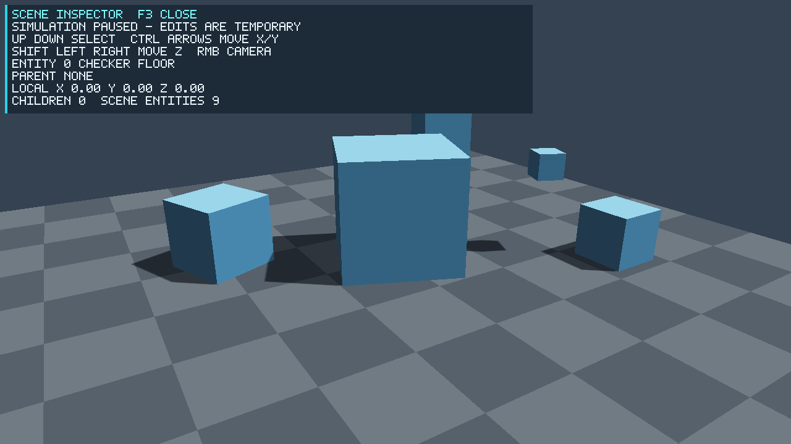

[한국어](README.md) · [日本語](README.ja.md) · [简体中文](README.zh.md)

# REMI Engine

**C++20 · DirectX 11 · HLSL · Windows x64**

REMI는 렌더링, 장면, 리소스, 물리, 수명 관리를 직접 구현하며 확장하는 소형 게임 엔진입니다. `REMIGravity`는 중력 반전 퍼즐, `REMIRelay`는 장애물을 돌아 스위치를 켠 뒤 제한 시간 안에 출구에 도착하는 별도 게임입니다.


## 주요 기능

| 분야 | 현재 구현 |
| --- | --- |
| 렌더링 | D3D11 RHI 버퍼·텍스처·파이프라인·명령·오프스크린 타깃, 변경 감지 ShaderCache, Standard/Unlit/Toon 셰이딩, 방향광, 2048² shadow map과 3×3 PCF, static mesh 프러스텀 컬링 |
| 장면·리소스 | 계층 Transform, 세대 검증 EntityId, 선형 시간 서브트리 삭제, 핸들 기반 Mesh/파일 캐시와 실패 복구 reload |
| 에셋·캐릭터 | 런타임 glTF/GLB 메시·기본색 텍스처·재질 임포트, `.remimat` 재질 파일, CPU 본 스키닝·클립 전환 상태 머신, 기존 RMCH 베이크 애니메이션 |
| 게임·진단 | AABB 물리, Gravity/Relay 게임, Pretendard HUD, Sandbox 위치 Inspector, CPU/GPU CSV와 재현 벤치마크, D3D debug layer 검사 |

현재 셰이더의 `metallic`·`roughness`는 **간이 조명 모델의 조정값**입니다. RHI가 리소스·드로 명령과 swap chain 표면을 담당하며, 기본 그림자 타깃·GPU 진단은 아직 D3D11 전용입니다. glTF 본 스키닝은 CPU에서 계산하며 PBR·IBL·GPU 스키닝·콘솔 지원은 아직 없습니다.

## 측정으로 확인한 개선

2026-10-05, i9-14900HX·Release 기준. 렌더링 값은 **64×64·D3D11 WARP·debug layer ON·VSync OFF** 진단 장면이다.

| 사례 | 비교 결과 |
| --- | --- |
| 1,000개 엔티티 컬링 OFF → ON | draw 1,000 → 20, CPU 제출 중앙값 10.6082 → 0.3475 ms, WARP GPU color 12.1184 → 0.1264 ms; 동일 픽셀 |
| 984바이트 파일 재로드 → 캐시 적중 | 중앙값 0.0999 → 0.0344 ms; OS 파일 캐시는 예열된 상태 |
| 5,001개 계층 삭제 | 이전 슬롯 검색 23.5416 → 자식 연결 순회 0.0691 ms; 이전 커밋과 동일 프로그램으로 비교 |

[측정 조건·재현 명령·원시 CSV·설계 이유](docs/PerformanceEvidence.md)에 범위와 한계를 기록했다. 이 값은 하드웨어 GPU의 게임 FPS를 뜻하지 않는다.

## 실행

Windows 10/11 x64, Visual Studio 2022의 C++ 데스크톱 도구와 Windows SDK, CMake 3.25 이상이 필요합니다.

### 실행 ZIP과 소스 ZIP 만들기

```powershell
powershell -ExecutionPolicy Bypass -File tools\package\build-release.ps1
```

스크립트는 현재 작업 트리의 소스 스냅샷을 만든 뒤, 그 스냅샷에서 `/MT` Release 빌드와 CTest를 수행합니다. `build\distributions\<생성 시각>\`에 Windows x64 실행 ZIP, 소스 ZIP, `SHA256SUMS.csv`, 검증 로그를 남깁니다. 실행 ZIP에는 세 프로그램과 필요한 셰이더·폰트·샘플·실행 안내만 들어갑니다. 로컬 Quinn 캐릭터 내보내기 파일은 포함하지 않으며, Gravity는 박스 캐릭터로 실행됩니다. 스크립트는 ZIP을 저장소 밖의 경로에 풀고 WARP 및 하드웨어 렌더링 smoke 실행까지 확인합니다. 배포 방법과 파일 목록은 [패키지 안내](tools/package/README.md)를 참고하세요.

소스 ZIP을 푼 뒤 Visual Studio 2022 C++ 도구와 Windows SDK가 있는 PC에서 `cmake --preset portable`, `cmake --build --preset portable`, `ctest --preset portable` 순서로 빌드와 테스트를 재현할 수 있습니다. 실행 ZIP은 별도 빌드 도구 없이 `START-HERE.txt`와 `.cmd` 실행기로 시작할 수 있습니다.

### 개발 빌드

```powershell
cmake --preset vs2022-x64
cmake --build --preset debug
ctest --preset debug
build\vs2022-x64\bin\Debug\REMIGravity.exe
build\vs2022-x64\bin\Debug\REMIRelay.exe
```

`WASD` 이동, `Space` 중력 반전, `Q` 재질 프리셋, 우클릭 드래그 카메라 회전, 휠 확대/축소, `Enter` 재시작, `F2` 성능 표시, `F5` 셰이더 재로드, `Esc` 종료입니다. [gravity.project.json](games/gravity/gravity.project.json)에서 셰이더·캐릭터·폰트 경로와 주요 레벨/물리 수치를 바꿀 수 있고 `--project <파일>`로 다른 프로젝트를 실행할 수 있습니다. 파일의 상대 경로는 해당 프로젝트 파일의 폴더를 기준으로 해석합니다. 로컬 캐릭터 에셋이 없으면 박스 캐릭터로 실행됩니다. `--character <파일>`에 `.rmc`, `.gltf`, `.glb`를 지정할 수 있습니다. `--idle-clip <이름> --move-clip <이름>`으로 동작 이름을 선택하며, glTF는 이름이 없으면 Stand/Idle 및 Run/Walk를 찾아 사용합니다. 자세한 임포트 규칙은 [AssetPipeline](docs/AssetPipeline.md)에 있습니다.

기본 코스 외에 `REMIGravity.exe --level 2`로 같은 엔진·게임 규칙을 재사용한 두 번째 코스를 실행할 수 있습니다. `--project`의 레벨 값을 바탕으로 발판 너비와 천장 높이를 조정합니다. 물리 계산은 엔진 `PhysicsWorld`, 중력 방향 전환은 `GravityControl`, 코인·승패 판정은 게임의 `GravityRules`에 분리했습니다.

`REMIRelay`는 `WASD` 이동, 우클릭 드래그 카메라, 휠 확대/축소, `Enter` 재시작, `Esc` 종료를 사용합니다. 청록색 스위치를 먼저 밟고 초록색 출구에 가면 성공합니다. 이 게임은 공통 Scene·Physics·Renderer·박스 메시 생성 경로를 사용하지만 자체 레벨 구성과 `RelayRules`를 가집니다. `--smoke --warp`로 자동 경로와 렌더링을 확인할 수 있습니다.

두 게임은 `SceneRenderSession`으로 렌더러·메시 캐시 수명과 그림자/색상 패스 조립을 공유합니다. 각 게임의 카메라, HUD, 애니메이션과 규칙은 별도 코드에 남겨 두었습니다.

Release/AddressSanitizer 빌드, Blender 변환 과정과 에셋 형식은 아래 기술 문서에 정리했습니다. 기본 실행 파일 외에 `REMISandbox` 렌더링·물리 데모와 `REMIBootstrap` 최소 실행 검증 앱이 있습니다.

## 기술 문서

- [Architecture](docs/Architecture.md) — 모듈 관계, 프레임 루프, 장면·리소스·캐릭터 경계
- [RenderingPipeline](docs/RenderingPipeline.md) — DirectX 11 초기화, 좌표 변환, 컬링, 그림자·색상 패스, 계측
- [ShaderImplementation](docs/ShaderImplementation.md) — HLSL 조명 수식, 재질 변수와 시각 품질의 한계
- [MemoryManagement](docs/MemoryManagement.md) — 객체 소유권, 핸들 무효화, 종료·누수 검증
- [AssetPipeline](docs/AssetPipeline.md) — glTF/GLB, 텍스처·재질 파일, 정적 장면·본 애니메이션 사용법과 제한
- [PerformanceEvidence](docs/PerformanceEvidence.md) — 컬링·캐시 비교, 계층 삭제 개선, 에셋 수명·실패 복구 검증

## Sandbox Inspector와 정적 에셋 재로드

```powershell
build\vs2022-x64\bin\Debug\REMISandbox.exe --inspector --static-gltf tests\fixtures\static_triangle.glb
```

`F3`으로 Inspector를 열고 닫는다. 편집 중에는 시뮬레이션이 멈춘다. `↑/↓`로 엔티티 선택, `Ctrl+방향키`로 로컬 X/Y 이동, `Shift+←/→`로 Z 이동, 우클릭·휠로 카메라를 조정한다. 편집은 메모리에만 적용되며 저장·undo는 없다. `F5`는 지정한 정적 glTF를 다시 읽는다. 실패하면 이전 GPU 자원을 유지한다.

`StaticGltfCache`는 여러 Scene에 같은 MeshHandle을 배치하고, Scene 해제와 에셋 제거를 분리한다. 같은 모델 안의 공통 이미지는 GPU 텍스처를 공유한다. 재로드는 primitive 수를 유지하는 정적 모델을 대상으로 한다.



코드의 출발점은 `engine/include/remi/`, `engine/src/`, `shaders/Basic.hlsl`, `games/gravity/`입니다. 현재 버전은 **0.11.0**입니다.
