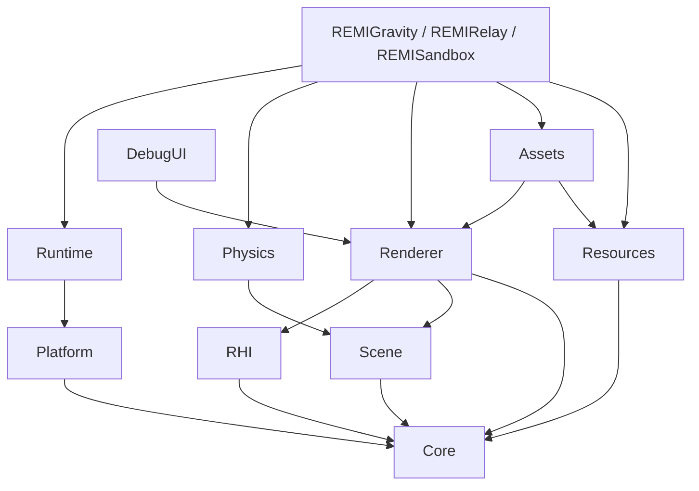

# REMI 엔진 아키텍처

REMI 0.11.0은 Windows x64에서 동작하는 C++20·DirectX 11 엔진이다. 엔진 코드는 `engine/`, 재사용 가능한 검증 앱은 `apps/`, 중력 반전 게임은 `games/gravity/`, 스위치·타임어택 게임은 `games/relay/`에 둔다. Visual Studio 2022와 CMake로 빌드하며, 현재 지원 플랫폼은 Windows뿐이다.

## 모듈과 의존성



| 모듈 | 책임 | 대표 코드 |
| --- | --- | --- |
| Core | 시간·입력 상태·수학·핸들·프로파일 데이터 | `engine/include/remi/core/` |
| Platform | Win32 창, 메시지, 입력 수집 | `engine/src/platform/Window.cpp` |
| Runtime | 창 수명, 고정 tick·프레임 콜백, Layer/Overlay 순서와 수명 | `engine/src/runtime/Application.cpp`, `engine/include/remi/runtime/Layer.hpp` |
| Scene | EntityId, Transform 계층, MeshComponent | `engine/src/scene/Scene.cpp` |
| Resources | 파일 로드와 타입별 캐시 | `engine/src/resources/ResourceManager.cpp`, `ResourceCache.hpp` |
| Physics | Scene 기반 AABB 동역학·접촉, 중력 반전 명령, 코드 기반 박스/시각 자식 생성 | `engine/src/physics/PhysicsWorld.cpp`, `GravityControl.cpp`, `SceneBuilder.cpp` |
| Renderer | 색상·그림자 패스, 텍스처 연결, GPU 계측과 게임용 패스 조립 | `engine/src/render/Renderer.cpp`, `SceneRenderSession.cpp` |
| RHI | 장치·버퍼·텍스처·파이프라인·렌더 명령·오프스크린 타깃 인터페이스와 D3D11 구현 | `engine/include/remi/rhi/`, `engine/src/rhi/` |
| Assets | 런타임 glTF/GLB·PNG/JPEG·재질 파일, CPU 본 스키닝·상태 머신 | `engine/src/assets/`, `engine/src/animation/` |
| DebugUI | 성능 오버레이 메시 | `engine/src/debug/DebugOverlay.cpp` |

`REMIGravity`는 `GravityLayer`를 `Application`에 등록해 엔진 루프와 게임 코드를 분리한다. 일반 Layer가 먼저, Overlay가 나중에 갱신되며 종료 시 역순으로 detach한다. `PhysicsWorld`는 물체·중력·접촉만 다루고, 엔진의 `TryReverseGravity`는 지지 접촉 조건에 따라 월드 중력을 뒤집으며 해당 물체의 중력축 속도만 제거한다. 코인 수집·승패 판정은 물리·Scene을 참조하지 않는 `GravityRules`가 맡고, `GravityGame`은 입력·물리·규칙·시각 표현을 연결한다. 재질 프리셋은 게임 코드에 남긴다. 입력은 아직 폴링 방식이므로 Hazel의 역순 이벤트 전파까지 구현한 것은 아니다.

레벨은 에디터 대신 코드와 프로젝트 설정으로 구성한다. `GravityLevel`은 발판·코인·목표·플레이어 시작점 등 게임 데이터를 보관하고, `GameProject`가 기본 JSON을 읽는다. `GravityLevelBuilder`는 그 데이터를 실제 장면으로 만들며, 엔진의 `SceneBuilder`를 통해 Transform·MeshComponent·선택적 PhysicsWorld Body를 일관되게 생성한다. `GravityGame`은 이동 입력과 게임 상태를 연결하고, `GravityRules`가 수집·승패를 계산한다. 따라서 다른 게임은 엔진의 `PhysicsWorld`·`TryReverseGravity`·`SceneBuilder`를 사용할 수 있으며 자체 레벨 빌더와 규칙을 작성하면 된다. `TryReverseGravity`는 **월드 전체**의 중력을 뒤집는 명령이지 물체별 중력은 아니다. `--level 2`는 동일한 빌더와 규칙으로 발판 너비·천장 높이가 다른 코스를 만든다. 현재 `GravityLevel`의 발판과 코인은 각각 정확히 세 개이며 범용 씬 직렬화나 에디터는 아니다.

`REMIRelay`가 두 번째 게임으로 이 경계를 검증한다. `RelayGame`은 엔진 `SceneBuilder`로 바닥·장애물·스위치·출구·동적 Player를 만들고 `PhysicsWorld`로 이동·충돌을 계산한다. `RelayRules`는 Scene/PhysicsWorld 없이 스위치 활성화, 제한 시간, 출구·실패 조건을 판정한다. 두 게임의 박스 메시 생성도 엔진 `CreateBoxMesh`로 공유한다. Relay는 자체 게임 코드와 실행 파일을 가지며 Gravity의 `GravityLevel`이나 `GravityRules`에 의존하지 않는다. 두 게임의 Layer는 공통 `SceneRenderSession`이 소유한 Renderer·Mesh 캐시로 그림자/색상 패스를 실행한다. glTF 추가 드로, HUD, 프로파일링, 카메라 갱신은 각 게임의 Layer에 남아 있다. 시작 시 창 크기·셰이더 경로·WARP/VSync 설정을 정하는 것도 호출자의 책임이다.

### 공개 Hazel 구조와의 비교

| 경계 | 공개 Hazel | 현재 REMI |
| --- | --- | --- |
| 실행/게임 | `Application`이 LayerStack을 갱신하고 이벤트를 역순 전파한다. | `Application`이 Layer/Overlay를 소유하고 고정 tick·프레임 콜백을 호출한다. 게임은 `GravityLayer`에 있다. 이벤트 handled 전파는 아직 없다. |
| 그래픽 API | `RendererAPI`의 명령 인터페이스와 OpenGL 구현을 분리한다. | `IRHIDevice`/`IRHIContext`/`IRHISurface`와 D3D11 구현을 분리한다. Shadow map과 GPU 진단에는 native D3D11 코드가 남아 있다. |
| 물리/레벨 | 공개 Hazel의 Layer 구조와 별개의 영역이다. | `PhysicsWorld`가 AABB 충돌을 처리하고 게임 설정 파일이 물리·핵심 레벨 수치를 제공한다. |

비교 기준: [Hazel Application](https://github.com/TheCherno/Hazel/blob/master/Hazel/src/Hazel/Core/Application.cpp), [LayerStack](https://github.com/TheCherno/Hazel/blob/master/Hazel/src/Hazel/Core/LayerStack.cpp), [RendererAPI](https://github.com/TheCherno/Hazel/blob/master/Hazel/src/Hazel/Renderer/RendererAPI.h). 공개 저장소의 RendererAPI는 OpenGL을 열거하며 DirectX 11 구현을 제공하지 않는다.

`RHIFactory`가 D3D11/WARP 장치를 만들고, `IRHIDevice`가 버퍼·텍스처·파이프라인·오프스크린 타깃과 창 표면을 생성한다. `IRHIContext`가 파이프라인과 리소스 바인딩, 인덱스 드로, 오프스크린 패스를 담당한다. `IRHISurface`가 swap chain·기본 색/깊이 타깃·resize·present·스크린샷 읽기를 소유한다. Shadow map 생성, GPU 질의·진단은 아직 `Renderer`의 D3D11 코드다. 다른 그래픽 API를 지원하려면 이 남은 부분도 분리해야 한다.

## 빌드와 실행 경로

```powershell
cmake --preset vs2022-x64
cmake --build --preset debug
ctest --preset debug
cmake --build --preset release
ctest --preset release

cmake --preset vs2022-x64-asan
cmake --build --preset asan
ctest --preset asan
```

`REMIGravity.exe`는 `build/vs2022-x64/bin/<구성>/`에 생성된다. CMake는 `gravity.project.json`·셰이더·폰트를 실행 파일 옆으로 복사한다. 게임은 프로젝트 파일 위치를 기준으로 에셋 경로를 해석하고 `--project <파일>`로 다른 설정을 지정할 수 있다. 같은 파일에서 중력, 이동 속도, 발판, 코인, 시작점, 목표와 낙하 경계를 설정한다. 장식 메시의 위치는 주요 레벨 데이터에서 파생하지만 장식 크기와 캐릭터 충돌 크기는 아직 게임 코드에 있다. 캐릭터 바이너리는 저장소에 포함하지 않는다.

## 프레임 흐름

`RunApplication`이 Win32 이벤트를 처리한 다음 `FixedStepper`로 1/60초 tick을 누적한다. 한 프레임에서 최대 8 tick을 실행하고 0.25초를 넘는 큰 경과 시간은 잘라낸다. 그 뒤 `OnFrame`에서 애니메이션 갱신과 렌더링을 실행한다. 창이 비활성화되거나 최소화되어 일시 정지할 때 입력과 누적 시간을 초기화한다.

```text
Win32 메시지/입력 → Application/Layer OnFixedUpdate(0~8회) → Application/Layer OnFrame(1회) → Present
```

`GravityLayer::OnAttach`에서 프로젝트 설정, 셰이더 바이트와 메쉬 캐시, 렌더러, 게임 월드를 구성한다. `OnDetach`에서는 게임·HUD·메시 소유자를 먼저 해제한 다음 렌더러의 D3D 잔존 객체를 검사한다. 소유권 세부 규칙은 [MemoryManagement.md](MemoryManagement.md)에 있다.

## 장면과 리소스 경계

Scene의 자식·형제 연결은 부모 변경과 함께 갱신하며, 서브트리 삭제는 전체 슬롯 재검색 없이 할당·재귀 없는 선형 순회로 처리한다. 이전 소스와의 비교는 [성능 사례](PerformanceEvidence.md)에 있다.

Sandbox는 `StaticGltfCache`로 정적 모델의 경로별 공유와 재로드를 관리하고, `SceneInspector`로 선택한 엔티티의 로컬 위치를 편집한다. Inspector가 열린 동안 시뮬레이션을 멈추며 편집은 저장하지 않는다. 정적 모델의 GPU 메시 캐시는 Scene보다 오래 유지할 수 있고, 명시적 제거 시 핸들이 무효화된다. 애니메이션 모델의 상태·로딩은 기존 GltfAsset/RMCH 경로에 남아 있다.

`EntityId`는 슬롯 인덱스·generation·Scene 식별자로 구성된다. Scene은 컴포넌트를 소유하며, 엔티티가 삭제되면 generation을 올려 이전 ID를 거부한다. 부모 Transform은 로컬 행렬을 부모까지 곱해 월드 행렬을 만든다. 현재 컴포넌트는 Transform과 MeshComponent를 명시적으로 지원하며 범용 ECS 레지스트리는 아니다.

`MeshComponent`는 GPU 포인터 대신 `MeshHandle`을 저장한다. 게임이 사용하는 `ResourceCache<Mesh>`가 실제 Mesh를 소유하고, 렌더 시 `DrawScene`의 resolver가 핸들을 메시로 바꾼다. `ImportStaticGltfScene`도 이 경로에 메시와 재질을 등록한다. `ResourceManager`는 파일 바이트의 중복 로드를 막지만 glTF·RMCH 디코더는 파일을 직접 읽는다. 파일 변경 추적과 로딩 정책이 모든 에셋에 통합된 구조는 아직 아니다.

## 캐릭터 파이프라인

캐릭터에는 두 경로가 있다. RMCH는 Blender 변환 도구가 프레임별 정점을 저장하고 런타임에서 두 프레임을 보간한다. glTF/GLB는 원본 메시·본·클립을 런타임에서 읽고 `Animator`가 본 행렬을 계산한다. `GltfAsset`은 가중치 네 개를 CPU에서 스키닝해 동적 vertex buffer에 올린다. `AnimStateMachine`은 조건에 따른 클립 전환과 크로스페이드를 담당한다. 둘 다 `REMIGravity --character <파일>`로 선택 가능하다. GPU 스키닝은 아직 없다.

RMCH 베이크가 필요한 경우 Blender 5.1에서 action을 변환한다. 별도 FBX 동작 파일은 `--clip` 대신 `--animation idle=idle.fbx --animation run=run.fbx`를 사용한다. `--mesh <오브젝트명>`으로 LOD를 선택하고 `--texture <재질 슬롯 또는 이름>=<이미지 파일>`로 diffuse 색을 정점에 베이크할 수 있다. glTF 경로는 자체 테스트용 `.gltf`/`.glb`와 로컬 Rover GLB로 실행을 검증했다. 다른 모델의 축·크기·재질은 개별 확인이 필요하다.

```powershell
blender --background --python tools/bake_character.py -- --source character.glb --clip idle=Idle --clip run=Run --output character.rmc
build\vs2022-x64\bin\Debug\REMIGravity.exe --character character.rmc
```

## 검증과 현재 범위

CTest는 Scene, 물리, 리소스, 렌더러, 캐릭터 파일 등을 검사한다. D3D11 debug layer 경고와 종료 시 live object 검사를 별도로 수행한다. CPU 단계와 GPU shadow/color 시간은 게임 CSV로 기록할 수 있다. 검증 방법은 [RenderingPipeline.md](RenderingPipeline.md)와 [MemoryManagement.md](MemoryManagement.md)에 적었다.

REMI는 학습·포트폴리오용 소형 엔진이다. 현재 범위에는 범용 에디터, 콘솔 백엔드, 멀티스레드 렌더러가 포함되지 않는다. glTF는 첫 번째 스킨과 기본색 텍스처 중심의 구현이며 완전한 glTF/PBR 지원은 아니다.
