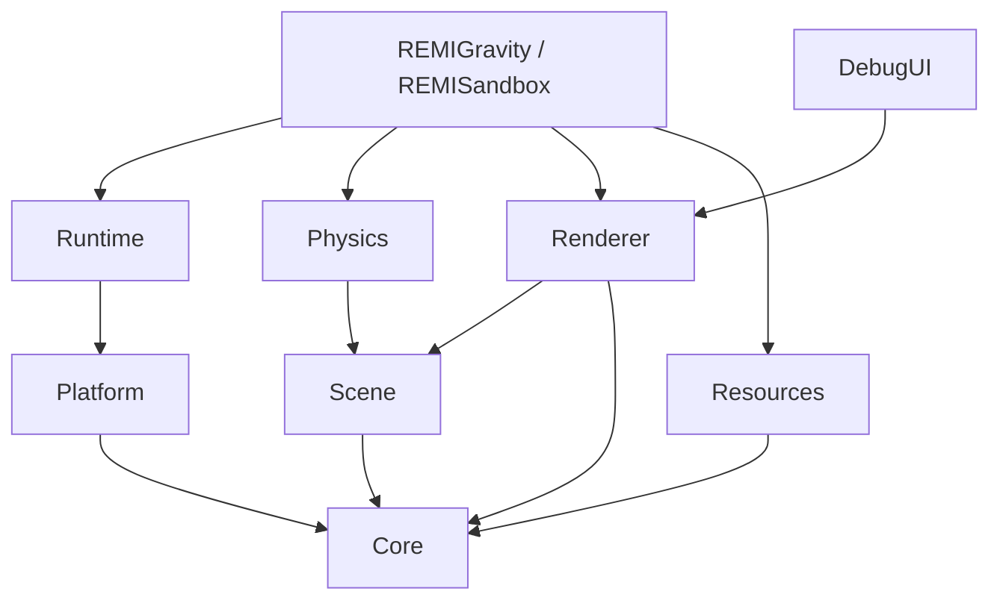

# REMI 엔진 아키텍처

REMI 0.11.0은 Windows x64에서 동작하는 C++20·DirectX 11 엔진이다. 엔진 코드는 `engine/`, 재사용 가능한 검증 앱은 `apps/`, 중력 반전 게임 규칙은 `games/gravity/`에 둔다. Visual Studio 2022와 CMake로 빌드하며, 현재 지원 플랫폼은 Windows뿐이다.

## 모듈과 의존성



| 모듈 | 책임 | 대표 코드 |
| --- | --- | --- |
| Core | 시간·입력 상태·수학·핸들·프로파일 데이터 | `engine/include/remi/core/` |
| Platform | Win32 창, 메시지, 입력 수집 | `engine/src/platform/Window.cpp` |
| Runtime | 창 수명과 고정 tick·프레임 콜백 | `engine/src/runtime/Application.cpp` |
| Scene | EntityId, Transform 계층, MeshComponent | `engine/src/scene/Scene.cpp` |
| Resources | 파일 로드와 타입별 캐시 | `engine/src/resources/ResourceManager.cpp`, `ResourceCache.hpp` |
| Physics | Scene 기반 AABB 동역학·접촉 | `engine/src/physics/PhysicsWorld.cpp` |
| Renderer | D3D11 자원·그림자·색상 패스·GPU 계측 | `engine/src/render/Renderer.cpp` |
| DebugUI | 성능 오버레이 메시 | `engine/src/debug/DebugOverlay.cpp` |

`REMIGravity`는 엔진 라이브러리를 사용하는 게임 사례다. 코인 수집, 중력 반전 조건, 승패 판정과 재질 프리셋은 게임 코드에 남긴다. `PhysicsWorld`는 게임 규칙을 모르고 Scene의 물체·중력·접촉만 다룬다.

## 빌드와 실행 경로

```powershell
cmake --preset vs2022-x64
cmake --build --preset debug
ctest --preset debug
cmake --build --preset release
ctest --preset release

cmake --preset vs2022-x64-asan
cmake --build --preset asan
ctest --preset asan
```

`REMIGravity.exe`는 `build/vs2022-x64/bin/<구성>/`에 생성된다. CMake는 셰이더·폰트를 실행 파일 옆으로 복사한다. 로컬 `assets/characters/default.rmc`가 있으면 기본 캐릭터로 복사하고, 없으면 로컬 Quinn v1 파일을 대신 사용할 수 있다. 둘 다 없으면 박스로 실행된다. 캐릭터 바이너리는 저장소에 포함하지 않는다.

## 프레임 흐름

`RunApplication`이 Win32 이벤트를 처리한 다음 `FixedStepper`로 1/60초 tick을 누적한다. 한 프레임에서 최대 8 tick을 실행하고 0.25초를 넘는 큰 경과 시간은 잘라낸다. 그 뒤 `OnFrame`에서 애니메이션 갱신과 렌더링을 실행한다. 창이 비활성화되거나 최소화되어 일시 정지할 때 입력과 누적 시간을 초기화한다.

```text
Win32 메시지/입력 → OnFixedUpdate(0~8회) → OnFrame(1회) → Present
```

`GravityApp::OnStart`에서 셰이더 바이트와 메쉬 캐시, 렌더러, 게임 월드를 구성한다. `OnStop`에서는 게임·HUD·메시 소유자를 먼저 해제한 다음 렌더러의 D3D 잔존 객체를 검사한다. 소유권 세부 규칙은 [MemoryManagement.md](MemoryManagement.md)에 있다.

## 장면과 리소스 경계

`EntityId`는 슬롯 인덱스·generation·Scene 식별자로 구성된다. Scene은 컴포넌트를 소유하며, 엔티티가 삭제되면 generation을 올려 이전 ID를 거부한다. 부모 Transform은 로컬 행렬을 부모까지 곱해 월드 행렬을 만든다. 현재 컴포넌트는 Transform과 MeshComponent를 명시적으로 지원하며 범용 ECS 레지스트리는 아니다.

`MeshComponent`는 GPU 포인터 대신 `MeshHandle`을 저장한다. 게임이 사용하는 `ResourceCache<Mesh>`가 실제 Mesh를 소유하고, 렌더 시 `DrawScene`의 resolver가 핸들을 메시로 바꾼다. `ResourceManager`는 파일 바이트의 중복 로드를 막는다. 캐릭터 RMCH 로더는 현재 `BakedAnimation::Load`를 통해 별도로 파일을 읽으므로 모든 에셋이 하나의 통합 리소스 시스템을 통과하는 구조는 아직 아니다.

## 캐릭터 파이프라인

Blender 변환 도구 `tools/bake_character.py`가 리깅된 모델의 변형된 정점 위치를 프레임별 RMCH v2로 저장한다. v2는 이름 있는 여러 클립을 지원한다. `REMIGravity --character <파일> --idle-clip <이름> --move-clip <이름>`으로 게임 코드 변경 없이 선택할 수 있다. v1 Quinn도 읽는다. 현재 런타임은 정점 데이터를 CPU에서 보간해 동적 vertex buffer를 갱신한다. 본 행렬을 GPU에서 스키닝하는 구조는 아니다.

Blender 5.1에서 모델에 애니메이션 action이 포함되어 있다면 다음과 같이 변환한다. 별도 FBX 동작 파일은 `--clip` 대신 `--animation idle=idle.fbx --animation run=run.fbx`를 사용한다. `--mesh <오브젝트명>`으로 LOD를 선택하고 `--texture <재질 슬롯 또는 이름>=<이미지 파일>`로 diffuse 색을 정점에 베이크할 수 있다. 실제 검증한 입력은 Quinn FBX와 별도 동작·diffuse PNG이며 glTF 및 다른 실물 모델의 결과는 아직 검증하지 않았다.

```powershell
blender --background --python tools/bake_character.py -- --source character.glb --clip idle=Idle --clip run=Run --output character.rmc
build\vs2022-x64\bin\Debug\REMIGravity.exe --character character.rmc
```

## 검증과 현재 범위

CTest는 Scene, 물리, 리소스, 렌더러, 캐릭터 파일 등을 검사한다. D3D11 debug layer 경고와 종료 시 live object 검사를 별도로 수행한다. CPU 단계와 GPU shadow/color 시간은 게임 CSV로 기록할 수 있다. 검증 방법은 [RenderingPipeline.md](RenderingPipeline.md)와 [MemoryManagement.md](MemoryManagement.md)에 적었다.

REMI는 학습·포트폴리오용 소형 엔진이다. 현재 범위에는 범용 에디터, 런타임 glTF 로더, 콘솔 백엔드, 멀티스레드 렌더러가 포함되지 않는다.
