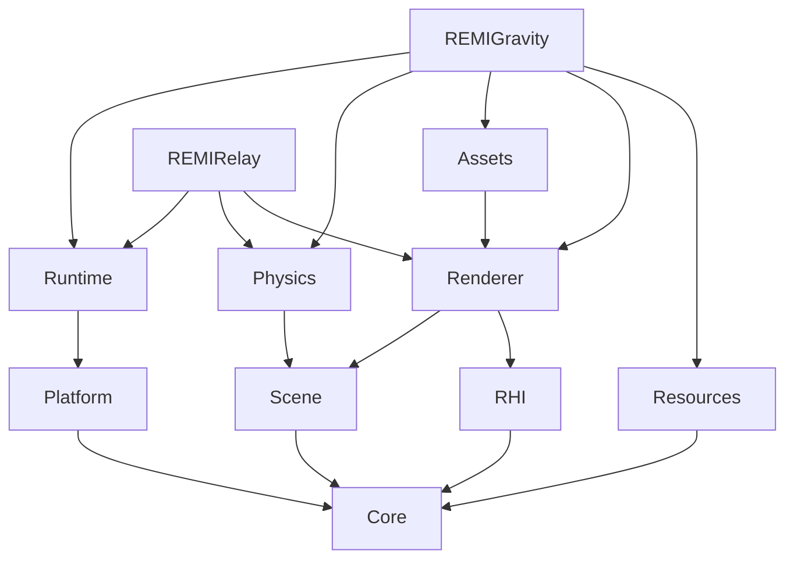
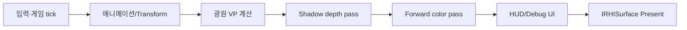

# REMI Engine 전체 설계·구현 가이드

> 기준: 현재 저장소의 C++ 코드와 CMake 프로젝트. 프로젝트 버전은 `0.11.0`이며, 이 문서는 Phase별 계획이 아니라 **지금 구현되어 실제로 실행되는 구조**를 설명한다. 아래의 “의도”는 설계 목적이고 “현재 구현”은 코드에서 확인되는 동작이다. 계획이나 상용 엔진의 기능을 구현 완료로 표현하지 않는다.

## 목차

1. [엔진의 목표와 현재 범위](#1-엔진의-목표와-현재-범위)
2. [저장소와 모듈 구조](#2-저장소와-모듈-구조)
3. [실행 시작부터 종료까지](#3-실행-시작부터-종료까지)
4. [Core·Platform·Runtime](#4-coreplatformruntime)
5. [Scene·Entity·Component](#5-sceneentitycomponent)
6. [리소스·소유권·메모리](#6-리소스소유권메모리)
7. [RHI와 DirectX 11 백엔드](#7-rhi와-directx-11-백엔드)
8. [Renderer와 프레임별 렌더링 파이프라인](#8-renderer와-프레임별-렌더링-파이프라인)
9. [HLSL 셰이더와 재질](#9-hlsl-셰이더와-재질)
10. [에셋·텍스처·캐릭터·애니메이션](#10-에셋텍스처캐릭터애니메이션)
11. [물리 시스템](#11-물리-시스템)
12. [REMIGravity 게임과 데이터 파일](#12-remigravity-게임과-데이터-파일)
13. [HUD·디버그·프로파일링](#13-hud디버그프로파일링)
14. [빌드·실행·검증](#14-빌드실행검증)
15. [구현 경계와 다음 설계 과제](#15-구현-경계와-다음-설계-과제)

## 1. 엔진의 목표와 현재 범위

REMI는 **Windows x64에서 동작하는 C++20·DirectX 11 학습/포트폴리오용 소형 3D 엔진**이다. 목표는 창과 입력, 장면, 리소스, 물리, 렌더링, 애니메이션, 진단의 책임과 객체 수명을 구분한 뒤 그 위에 서로 다른 플레이 가능한 게임을 올리는 것이다. Visual Studio 2022/MSVC와 CMake를 사용한다. `REMIGravity`와 `REMIRelay`는 엔진 사용 사례이고 `REMISandbox`는 렌더링·장면·물리 검증 앱, `REMIBootstrap`은 최소 실행 검증 앱이다.

현재 대표 데모 `REMIGravity`는 발판에서 출발해 중력을 뒤집고 천장의 코인 세 개를 수집한 뒤 목표에 도착한다. 별도 실행 파일 `REMIRelay`는 장애물을 피해 스위치를 활성화하고 제한 시간 안에 출구로 가는 게임이다. 코드의 기능을 이해할 때는 **엔진의 범용 기능**과 **각 게임의 규칙**을 구별해야 한다. 예를 들어 `PhysicsWorld`의 중력·AABB 충돌과 `TryReverseGravity` 명령은 엔진 기능이지만 코인 세 개 수집은 `GravityRules`, 스위치·제한 시간은 `RelayRules`의 규칙이다.

현재 버전은 범용 에디터나 상용 게임 엔진의 완성형 물리·PBR 렌더러가 아니다. 지원 그래픽 백엔드는 D3D11 하나이고, 물리는 축 정렬 박스(AABB), 기본 렌더링은 forward color pass와 방향광 shadow pass를 사용한다. 이 제약을 숨기지 않는 것이 엔진 설계를 정확히 설명하는 출발점이다.

## 2. 저장소와 모듈 구조

```text
REMI/
├─ engine/include/remi/    공개 엔진 API
├─ engine/src/             엔진 구현
│  ├─ core/                수학·빌드 정보
│  ├─ platform/            Win32 Window/입력
│  ├─ runtime/             Application/Layer 루프
│  ├─ scene/               Entity·Transform·MeshComponent
│  ├─ resources/           파일 로더·타입별 캐시
│  ├─ physics/             Scene 기반 AABB 물리
│  ├─ rhi/                 그래픽 인터페이스와 d3d11/ 구현
│  ├─ render/              Renderer·카메라·컬링·ShaderCache·RMCH
│  ├─ assets/              glTF·이미지·재질
│  ├─ animation/           본 애니메이션·상태 머신
│  └─ debug/               디버그 오버레이
├─ games/gravity/          게임 규칙·게임 Layer·HUD·프로젝트 JSON
├─ games/relay/            스위치·타임어택 규칙과 별도 게임 실행 파일
├─ apps/bootstrap/        최소 앱
├─ apps/sandbox/          엔진 검증 앱
├─ shaders/Basic.hlsl     현재 기본 HLSL
├─ tests/                 CTest 검증 코드와 작은 fixture
├─ tools/                 Blender 캐릭터 베이크 도구 등
└─ third_party/           cgltf·stb·nlohmann/json
```

`engine/CMakeLists.txt`는 `remi_core`, `remi_platform`, `remi_runtime`, `remi_scene`, `remi_resources`, `remi_physics`, `remi_rhi`, `remi_renderer`, `remi_assets`, `remi_debugui`를 별도 라이브러리로 만든다. 이 분리는 파일 정리만을 위한 것이 아니다. 상위 모듈이 하위 책임을 사용하되, 게임 규칙을 엔진 라이브러리로 끌어올리지 않기 위한 **의존성 경계**다. 예를 들어 `Physics`는 `Scene`에 의존하고, `Renderer`는 `RHI`를 사용하며, `REMIGravity`는 이들을 조립한다. `Assets`는 `Renderer`의 메시와 텍스처 생성 기능을 이용한다.



**설계 의도:** 게임을 바꾸더라도 메인 루프·입력·렌더 리소스·물리 충돌을 다시 작성하지 않도록 한다. **현재 범위:** 모듈 분리는 존재하지만 엔진 전체가 임의의 컴포넌트·그래픽 API·게임 프로젝트를 플러그인처럼 즉시 교체할 수 있는 수준은 아니다.

## 3. 실행 시작부터 종료까지

`games/gravity/main.cpp`의 `wmain`이 명령행을 읽고 `GravityLayer`를 `Application`에 등록한다. `RunApplication`은 `Window`를 소유하면서 Layer의 attach/update/detach를 호출한다. `GravityLayer::OnAttach`가 프로젝트 JSON을 읽고 셰이더, 렌더러, 메시 캐시, 캐릭터, `GravityGame`, HUD를 만든다. 여기서 엔진은 **실행 순서와 수명**을, 게임 Layer는 **무엇을 로드하고 무엇을 플레이할지**를 결정한다.

```text
wmain
  → Application 생성·GravityLayer 등록
  → RunApplication: Window 생성
  → Layer::OnAttach: 설정·에셋·Renderer·Game 생성
  → Win32 메시지 처리와 Input 갱신
  → 고정 tick마다 Layer::OnFixedUpdate: 입력·게임 규칙·PhysicsWorld::Step
  → 프레임마다 Layer::OnFrame: 애니메이션·카메라·그림자·색상·HUD·Present
  → 종료 시 Layer::OnDetach: 게임/메시 해제 → Renderer 검증·해제
  → Window 해제
```

`Application`은 일반 Layer와 Overlay를 `unique_ptr`로 소유한다. 일반 Layer를 먼저, Overlay를 뒤에 배치하고 호출하며 종료 시 역순으로 `OnDetach`한다. Layer는 `OnAttach`, `OnResize`, `OnFixedUpdate`, `OnFrame`, `OnDetach`를 구현할 수 있다. 기존 `Application` 콜백도 남아 있어 `REMISandbox`처럼 앱 자체에서 동작을 구현하는 사용법을 유지한다. **현재 Layer는 입력 이벤트의 handled 플래그나 역순 이벤트 전파를 제공하지 않는다.** 입력은 `Window`의 상태를 tick에서 읽는 방식이다.

## 4. Core·Platform·Runtime

### 시간과 고정 tick

`FrameClock`은 `steady_clock`으로 프레임 경과 시간을 측정한다. `FixedStepper`는 경과 시간을 누적해 **1/60초 고정 tick**을 만들고, 한 프레임 최대 8회만 실행한다. 너무 긴 프레임은 0.25초까지 받아들이며 나머지 시뮬레이션 시간은 버린다. `alpha`는 남은 누적 시간의 비율로 프레임 콜백에 전달된다. 이렇게 하는 목적은 렌더 FPS 변화가 물리 적분 간격을 직접 바꾸지 않도록 하는 것이다. 큰 지연 뒤 무제한 tick을 따라잡느라 앱이 계속 멈추는 현상도 제한한다. 현재 게임은 `alpha`를 플레이어 Transform 보간에 사용하지 않으므로 고정 tick과 표시 사이의 시각적 보간은 완전하지 않다.

```text
FrameClock.Tick → FixedStepper.Advance
                         ├─ 0~8회 OnFixedUpdate(dt = 1/60)
                         └─ 1회 OnFrame(elapsed, alpha)
```

### 입력과 Win32 창

`Window`는 HWND 생성·삭제, 메시지 펌프, 크기 변경, 포커스, 최소화, DPI 관련 메시지를 담당한다. 키보드와 마우스 메시지를 엔진 `Input`으로 옮긴다. `Input::Held`는 현재 상태, `Pressed`/`Released`는 마지막 소비 이후의 edge다. 클릭이 두 tick 사이에 발생해도 edge를 보관하다 tick에서 소비한다. 마우스 위치·delta·휠도 제공한다. 포커스를 잃거나 창 크기 조절 중일 때 입력과 누적 시간을 초기화해 키가 눌린 채 남거나 복귀 시 시뮬레이션 시간이 몰리지 않게 한다. 렌더러가 client 영역을 소유할 때 GDI 페인팅을 끈다.

### 수학과 로깅

`Vec2`, `Vec3`, `Matrix4`, `TransformMatrix`는 Core의 작은 수학 계층이다. 행렬은 **row-major 저장·row-vector 곱셈**을 사용하고 `S * Rx * Ry * Rz * T` 순서로 로컬 Transform을 만든다. 빌드 정보는 버전과 구성(Debug/Release)을 제공한다. 로그는 시작·실패·장치 정보·셰이더 재로드·종료 진단을 기록한다. 현재 Core는 범용 선형대수 라이브러리나 작업 스케줄러를 목표로 구현한 것이 아니다.

## 5. Scene·Entity·Component

`Scene`은 엔티티 슬롯을 소유한다. `Create`는 기본 `TransformComponent`를 붙이고 `EntityId`를 반환한다. ID는 **슬롯 index + generation + Scene 식별자**를 포함한다. 엔티티 삭제 후 슬롯을 재사용하면 generation이 바뀌므로 이전 ID가 새 엔티티를 가리키지 않는다. 다른 Scene의 ID도 거부한다. generation이 한계에 도달한 슬롯은 재사용하지 않는다. `Clear`는 용량을 남겨 재사용하고, `Reset`은 저장소와 Scene 식별자를 교체한다.

현재 명시적으로 지원하는 컴포넌트는 두 가지다.

| 컴포넌트 | 저장 내용 | 용도 |
| --- | --- | --- |
| `TransformComponent` | 위치·Euler 회전·크기 | 로컬/월드 행렬과 부모 계층 |
| `MeshComponent` | `MeshHandle`, 표시 여부, 재질 값 | Scene 렌더링 |

`SetParent`는 계층을 만들며 순환·다른 Scene·오래된 ID를 거부한다. 부모 변경은 **KeepLocal**이다. 월드 행렬은 자식 로컬 행렬에서 부모를 따라 올라가며 곱한다. 부모를 삭제하면 자식도 삭제한다. `MeshComponent`가 GPU Mesh 포인터를 직접 소유하지 않고 핸들만 저장하는 이유는 Scene 수명과 GPU 리소스 수명을 분리하기 위해서다. `DrawScene`은 호출자가 건네준 resolver로 핸들을 실제 Mesh로 바꾼다. 핸들이 없거나 숨겨져 있거나 컬링된 수를 별도 통계로 반환한다.

이 구조는 고정된 슬롯과 `std::optional` 컴포넌트를 쓰는 **작은 Scene 구현**이다. 임의 타입을 런타임 등록하는 ECS, 쿼리 스케줄러, Scene 파일 직렬화, Prefab, 에디터용 undo/redo는 없다. 현재 물리 Body도 Scene 컴포넌트가 아니라 `PhysicsWorld`에 별도로 등록한다.

## 6. 리소스·소유권·메모리

### 파일과 객체 캐시

`ResourceManager`는 기준 폴더와 상대 경로를 합치거나 절대 경로를 받아 파일 바이트를 읽는다. 정규화한 경로를 캐시 key로 사용하고, 파일 유형·크기 한도(기본 64 MiB)·완전 읽기·읽는 중 변경 여부를 검사한다. **root는 상대 경로 해석 기준이지 보안 샌드박스가 아니다.** glTF/RMCH 디코더의 모든 읽기가 이 Manager를 거치는 것은 아니다.

`ResourceCache<T>`는 key별 중복 로딩을 막고 `unique_ptr<T>`를 단독 소유한다. 핸들에는 캐시 owner와 단조 증가하는 ID가 들어간다. 다른 캐시의 핸들이나 unload/clear 이후의 오래된 핸들은 조회되지 않는다. 로더가 실패하면 부분 삽입을 되돌리고 실패 횟수를 센다. 로딩 중 재진입과 로딩 중 제거를 거부한다. 메인 스레드 사용을 전제로 하며 비동기 스트리밍 캐시는 아니다.

### 실제 객체 소유권

| 객체 | 소유자 | 참조/해제 규칙 |
| --- | --- | --- |
| `Window` | `RunApplication` | 앱·Layer 콜백 동안만 참조 |
| `Layer` | `Application`의 `unique_ptr` | detach 후 소유자 파괴 |
| `Scene`, `PhysicsWorld` | 앱/게임의 `unique_ptr` | Scene이 PhysicsWorld보다 오래 살아야 함 |
| `Renderer`, 게임 Mesh 캐시 | Gravity/Relay의 `SceneRenderSession` | 게임별 Mesh/HUD 해제 뒤 캐시 → Renderer 순서로 종료 |
| `Mesh` | `ResourceCache<Mesh>` 또는 `GltfAsset` | Renderer 종료 전에 해제 |
| 파일·버퍼·파이프라인 | 각 캐시/객체의 `unique_ptr`, D3D 내부는 `ComPtr` | 소유자 종료 순서 준수 |
| 기본색 텍스처 | Mesh 간 `shared_ptr<IRHITexture>` | 마지막 참조 해제 |

`LifetimeToken`은 Window·Renderer·Mesh·Scene **소유자 수**를 센다. 이는 바이트 수나 드라이버 내부 할당량이 아니다. `Renderer::ShutdownAndValidate`는 살아 있는 Mesh가 있으면 종료를 거부하고, D3D 리소스를 해제한 뒤 Debug Layer의 warning/error/live-object 메시지를 확인한다. Debug Layer가 없는 PC에서는 그 검증을 수행할 수 없다. Gravity와 Relay는 게임별 HUD·애니메이션·glTF 소유자를 먼저 해제하고, `SceneRenderSession`이 Mesh 캐시와 Renderer를 순서대로 종료한다.

## 7. RHI와 DirectX 11 백엔드

RHI(Render Hardware Interface)는 상위 렌더러가 모든 버퍼·파이프라인·드로 명령을 D3D11 타입으로 직접 표현하지 않도록 만든 경계다. `RHITypes.hpp`는 백엔드·드라이버·버퍼·텍스처·파이프라인 설명자를 정의하고, `RHI.hpp`는 다음 인터페이스를 제공한다.

| 인터페이스 | 책임 |
| --- | --- |
| `IRHIDevice` | 장치 정보, 버퍼·텍스처·파이프라인·오프스크린 타깃·창 표면 생성 |
| `IRHIContext` | 렌더 패스, 리소스 바인딩, `DrawIndexed`, 오프스크린 읽기 |
| `IRHISurface` | HWND용 swap chain, 기본 색/깊이 타깃, resize·clear·Present·읽기 |
| `IRHIBuffer`, `IRHITexture`, `IRHIPipeline`, `IRHIRenderTarget` | 개별 GPU 자원과 최소 공통 정보 |

`RHIFactory::CreateDevice`가 선택한 백엔드를 생성한다. 현재 유효한 백엔드는 **D3D11 하나**이며 하드웨어 또는 WARP 소프트웨어 드라이버를 선택할 수 있다. D3D11 백엔드는 feature level 11.0 장치/즉시 컨텍스트를 만들고, 요청 시 Debug Layer를 사용한다. `D3D11Surface`는 flip-discard swap chain과 sRGB RTV, depth/stencil buffer를 소유한다. `D3D11CommandContext`는 입력 레이아웃, VS/PS, 버퍼, 텍스처를 바인딩하고 draw를 호출한다. 다른 장치에 속한 자원을 잘못 전달하면 거부한다.

**현재 경계의 남은 부분:** `Renderer.cpp`는 D3D11 헤더를 여전히 포함한다. 방향광 shadow map의 native depth/SRV/sampler 생성과 GPU timestamp query, Debug Layer 메시지·live-object 진단, 일부 state 바인딩은 RHI 바깥에 남아 있다. 따라서 “RHI 인터페이스가 있으므로 Vulkan이나 콘솔 백엔드를 바로 붙일 수 있다”는 주장은 맞지 않는다. 이번 경계가 실제로 분리한 대상은 버퍼·텍스처·파이프라인·대부분의 명령과 창 surface다.

## 8. Renderer와 프레임별 렌더링 파이프라인

### 초기화와 Mesh

`RendererConfig`는 HWND, 크기, 셰이더 파일/소스, WARP, Debug Layer 요청, VSync를 받는다. Renderer는 RHI 장치와 surface, `ShaderCache`, 셰이딩 모델별 파이프라인, per-object constant buffer, shadow map, GPU query를 준비한다. `Vertex`는 position·color·normal·UV를 담고 구조 크기는 44바이트다. 정적 메시에는 변경되지 않는 vertex/index buffer, 애니메이션 메시에는 동적 vertex buffer를 사용한다. 메시 생성은 빈 데이터, 3의 배수가 아닌 index 수, 범위 밖 index, 비유한 정점 값을 거부한다. 동적 메시 갱신은 정점 수와 소유 장치를 검사한다.

Gravity와 Relay의 Layer는 `SceneRenderSession`을 통해 Renderer와 Mesh 캐시를 함께 소유한다. 세션은 공통 그림자/색상 패스의 Scene 메시 조회·누락 검사를 처리하고, 추가 드로 콜백으로 Gravity의 glTF 캐릭터를 붙인다. 카메라, 게임별 HUD, 프로파일링과 Present는 Layer의 책임이다. 별도의 검증 앱은 저수준 Renderer를 직접 사용할 수 있다.

### 프레임 순서



1. 게임 Layer가 카메라와 방향광의 view-projection 행렬을 만든다.
2. `BeginShadow`가 shadow depth target을 묶고, `DrawScene` 및 별도 `GltfAsset::DrawShadow`가 그림자용 메쉬를 그린다. `EndShadow`는 색상 패스로 전환한다.
3. 색상 패스에서 `DrawScene`은 각 `MeshComponent`의 월드 행렬과 MVP를 구해 컬링하고, `DrawLitPrepared`가 조명·재질을 담은 constant buffer를 갱신해 RHI 명령으로 그린다. glTF 캐릭터는 여러 primitive/재질을 갖기 때문에 `GltfAsset::Draw` 경로로 별도 그린다.
4. 게임 HUD와 디버그 오버레이를 색상 장면 위에 그린다. 필요할 때만 진단용 스크린샷을 읽고 `Present`한다.

이것은 **forward renderer**다. G-buffer/deferred shading이나 render graph가 아니다. `IRHIRenderTarget`은 별도의 오프스크린 타깃과 RGBA 읽기를 지원하지만 기본 게임 패스 그래프에는 연결돼 있지 않다.

### 좌표계와 카메라

REMI의 현재 카메라/투영은 **왼손 좌표계**이고 행렬은 row-major/row-vector 규칙을 따른다. 정점은 `local * world * view * projection`으로 변환한다. HLSL도 `mul(float4(position,1), matrix)`를 쓴다. glTF의 오른손 좌표를 읽을 때는 Z축 부호를 바꾸고 삼각형 winding을 뒤집는다. `Camera`는 target·yaw·pitch·distance로 orbit 시점을 만들고, 마우스 이동으로 회전, 휠로 거리를 조절한다. `XMMatrixLookAtLH`와 `XMMatrixPerspectiveFovLH`를 사용하고 비정상적인 FOV·near/far·거리 등을 거부한다.

### 컬링

`Mesh::IntersectsClip`은 정적 메시 로컬 AABB의 여덟 모서리를 MVP로 보내 클립 공간에서 프러스텀 바깥인지 판단한다. Shadow pass에는 광원 행렬, color pass에는 카메라 행렬을 사용한다. 동적 메시의 바인드 포즈 AABB는 현재 애니메이션 포즈와 다를 수 있으므로 **컬링하지 않는다**. 이는 캐릭터가 잘못 사라지는 것보다 보수적으로 더 그리는 선택이다. `SceneDrawStats`가 그린 수, 숨긴 수, 누락된 핸들 수, 컬링 수를 제공한다.

### 그림자

`DirectionalShadowMatrix`는 방향광을 향한 직교 투영을 만든다. 현재 shadow map은 **2048×2048 단일 R32 typeless 텍스처**다. depth pass에서는 D32 DSV로 쓰고 color pass에서는 R32 SRV로 읽는다. 같은 자원을 동시에 DSV/SRV로 묶지 않도록 pass 전환 시 SRV 바인딩을 해제한다. HLSL은 비교 샘플러로 3×3 PCF를 계산하고 depth bias를 적용한다. 이는 하나의 방향광에 대한 고정 해상도 그림자이며 cascade shadow maps나 contact shadows는 없다.

## 9. HLSL 셰이더와 재질

현재 기본 HLSL은 `shaders/Basic.hlsl`의 `VSMain`/`PSMain`이다. `ShaderCache`가 `vs_5_0`/`ps_5_0`으로 컴파일하고 `SHADING_MODEL` 매크로 값에 따라 pixel shader의 **Standard, Unlit, Toon** 조합을 캐시한다. Vertex shader는 한 조합을 공유한다. Debug에서는 최적화를 끄고 진단 정보를 넣으며, Release에서는 최적화 레벨 3을 사용한다. 경고도 컴파일 오류로 취급한다.

파일 변경 시에는 이전에 요청된 모든 조합을 먼저 다시 컴파일한다. 성공하면 새 bytecode와 GPU 파이프라인·입력 레이아웃을 교체하고, 실패하면 이전 파이프라인을 유지한다. 게임은 주 HLSL 파일을 약 1초마다 확인하고 `F5`로 수동 재로드할 수도 있다. 명시적 소스 문자열 교체도 가능하다. **소스 문자열 모드는 `#include`를 지원하지 않고, 자동 감시는 주 HLSL 파일만 대상으로 한다.**

정점 셰이더는 위치를 clip 공간에, 월드 위치와 광원 clip 위치를 픽셀 셰이더에 전달한다. 픽셀 셰이더는 정점 색에 선택적인 기본색 텍스처를 곱한다. 유효한 노멀이 있으면 smooth normal을 쓰고 없으면 `ddx`/`ddy`로 면 노멀을 계산한다. 방향광 확산광은 `max(0, dot(N, -L))`, 그림자 가시도는 PCF 비교 샘플 평균이다. Standard는 ambient, 위쪽을 향한 노멀에 따른 약한 sky fill, 보조광, half-vector 하이라이트를 조합한다. Toon은 확산광을 단계화한다. Unlit은 직접 조명의 영향을 받지 않는다.

`MaterialProperties`는 tint, metallic, roughness, emissive, shading model을 담는다. **metallic/roughness는 이 경험적 하이라이트 수식의 조정값이지 물리 기반 BRDF를 완성했다는 뜻이 아니다.** normal map, metallic-roughness map, IBL, GGX/Fresnel, HDR tone mapping은 현재 기본 렌더링에 없다. 노멀을 월드 행렬의 3×3으로 변환하므로 비균일 스케일에서는 inverse-transpose normal matrix와 결과가 다를 수 있다. sRGB RTV와 sRGB 기본색 텍스처 지원은 있지만 전체 색 관리 체계는 아니다.

## 10. 에셋·텍스처·캐릭터·애니메이션

### glTF/GLB와 정적 장면

`GltfLoader`는 `cgltf`를 이용해 glTF/GLB의 삼각형 primitive, 정점 속성, 재질, 이미지, 노드, 첫 번째 skin, 애니메이션 데이터를 읽는다. `GltfAsset::Load`는 primitive마다 GPU Mesh를 만들고 기본색 재질/이미지를 연결한다. 내장 이미지, 외부 이미지, data URI를 다루며 PNG/JPEG 이미지는 `stb_image`로 RGBA8에 디코딩한다. 텍스처는 RHI texture로 올린다. `ImportStaticGltfScene`은 정적 glTF primitive를 일반 `Scene`과 `ResourceCache<Mesh>`에 등록한다. 정적 임포트는 노드 월드 변환을 정점에 적용한다.

glTF 재질의 기본색 계수와 metallic·roughness 값은 현재 `MaterialProperties`로 변환한다. 모델 옆 `materials/<모델명>_<재질 인덱스>.remimat` 파일로 shading model, tint, metallic, roughness, emissive, 기본색 텍스처를 덮어쓸 수 있다. `.remimat`의 텍스처 경로는 **그 재질 파일의 위치**를 기준으로 해석한다. `LoadMaterial`/`SaveMaterial`도 제공한다. 이 파일은 완전한 노드 기반 머티리얼 시스템이 아니라 간단한 JSON 재질 설정이다.

### 본 애니메이션

`Animator`는 glTF 노드 계층, inverse bind matrix, 클립 채널을 사용해 본 행렬을 계산한다. 위치·회전·크기 채널의 STEP/LINEAR/CUBICSPLINE 샘플링과 클립 간 crossfade를 지원한다. `AnimStateMachine`은 파라미터 조건으로 상태를 바꾸고 애니메이터에 전환을 요청한다. 게임은 `moving` 파라미터로 대기/이동 클립을 전환한다. `GltfAsset::Update`는 정점당 최대 네 joint/weight를 CPU에서 적용한 결과를 동적 vertex buffer로 업로드한다. 따라서 **현재는 GPU 스키닝이 아니라 CPU 스키닝**이며 정점 수가 큰 캐릭터에서는 CPU와 업로드 비용이 증가한다.

### 기존 RMCH 경로

`.rmc`/RMCH는 Blender 도구 `tools/bake_character.py`가 애니메이션의 각 프레임 정점·노멀·색을 저장하는 베이크 형식이다. `BakedAnimation`이 이름 붙은 클립을 읽고 인접 프레임을 CPU에서 보간해 동적 Mesh를 갱신한다. 이는 본 행렬을 실시간 계산하는 glTF 경로와 다른 방식이다. 기존 v1과 이름 붙은 v2 클립을 지원하며 파일 헤더·범위·유한한 데이터 등을 검증한다. glTF 모델/애니메이션을 바로 사용하려면 `.gltf`/`.glb`, 베이크 파일을 사용하려면 `.rmc`를 선택한다.

### 캐릭터 선택

`REMIGravity --character <파일>`로 `.rmc`, `.gltf`, `.glb`를 지정할 수 있다. 기본 캐릭터 경로는 프로젝트 JSON에 있다. glTF는 `--idle-clip`, `--move-clip`을 지정하면 정확한 이름을 요구한다. 지정하지 않으면 Idle/Stand, Run/Walk가 들어간 이름을 찾고 없으면 앞쪽 클립을 사용한다. 캐릭터 파일이 없으면 박스 캐릭터로 실행한다. 캐릭터 메시가 Player 물리 루트의 **자식 visual 엔티티**가 되는 이유는 물리 AABB의 회전 제약과 캐릭터의 방향·중력 반전 시각 회전을 분리하기 위해서다.

glTF 지원은 삼각형 primitive와 첫 번째 skin(최대 512 joint), 기본색 중심이다. 다중 skin, morph target, alpha blend/mask, double-sided 처리, normal/occlusion/metallic-roughness map, 완전한 glTF PBR과 GPU 스키닝은 구현되지 않았다. 에셋이 Blender나 다른 엔진에서 보이는 외관이 그대로 재현된다는 보장은 없다.

## 11. 물리 시스템

`PhysicsWorld`는 살아 있는 `Scene`을 참조하고 `EntityId`별 Body를 관리한다. `BodyDesc`는 Static/Dynamic, **월드 공간 축 정렬 half extent**, 속도, 질량, collision layer/mask를 갖는다. Body의 시각 Mesh 크기와 충돌 크기는 독립적이다. 물리 Body에는 부모가 없고 회전이 0인 루트 Transform이 필요하다. 즉, 회전한 박스나 부모가 움직이는 물체의 충돌은 현재 지원하지 않는다.

고정 `Step(dt)`의 주요 과정은 다음과 같다.

1. 유효한 step 시간, Transform, 속도와 적분 결과를 검사한다. Scene에서 이미 삭제된 Body는 제거한다.
2. Dynamic Body의 속도에 중력 가속도를 적분한다. 축별로 이동하면서 Static AABB와의 경계를 검사해 빠른 물체가 얇은 정적 벽을 직선으로 통과하는 것을 줄인다.
3. Body 쌍을 검사해 겹침이 있으면 가장 얕은 축으로 관통을 수정하고, 역질량 비율에 따라 위치·법선 속도를 조정한다. `solverIterations`만큼 반복한다.
4. 충돌 pair의 두 방향 layer/mask가 모두 맞을 때만 검사한다. 접촉 목록과 candidates/contacts 통계를 만든다.

`PhysicsSettings`에서 기본 중력 `(0,-9.81,0)`, 최대 step, 접촉 허용오차, 반복 횟수, 반발계수를 설정할 수 있다. 게임 JSON은 중력 크기와 나머지 주요 물리 설정을 제공한다. `SetGravity`는 중력 반전 시 이전 접촉을 지워 낡은 접지 상태가 남지 않게 한다. `Supported`는 현재 중력 방향의 반대 법선으로 받쳐 주는 접촉이 있는지 검사한다. 따라서 바닥뿐 아니라 중력을 뒤집었을 때 천장도 “접지”가 될 수 있다.

이 시스템은 일반적인 충돌 라이브러리 전체가 아니다. Body 쌍 검사는 기본적으로 **O(n²)**이며 broadphase 공간 분할이 없다. Static 벽에 대한 축별 sweep은 있으나 빠르게 서로 교차하는 **Dynamic–Dynamic 충돌은 연속 충돌 검출(CCD)이 아니다**. 마찰, 관성 텐서, 각속도, 회전 강체, 다양한 collider 형태, constraint/joint, sleeping, deterministic network rollback은 없다. 물리 파라미터가 설정 가능해진 것과 상용 엔진 수준 물리가 된 것은 다르다.

## 12. REMIGravity 게임과 데이터 파일

게임은 `GravityRules`가 코인·시간·승패 상태를 소유하고, `GravityGame`이 입력·물리·규칙·캐릭터 표현을 연결한다. `GravityLayer`는 렌더러·카메라·HUD와 게임을 연결한다. `GravityGame::Restart`는 Scene과 PhysicsWorld를 새로 만들고 `GravityLevelBuilder`에 레벨 구성을 맡긴다. 이 게임 전용 빌더는 엔진 공통 `SceneBuilder`로 Transform, MeshComponent와 선택적 물리 Body를 생성한다. 시작 시 물리를 한 번 진행해 접촉 상태를 세운다. `Tick`은 입력을 검증하고 다음을 수행한다.

- `WASD`의 x/z 이동 벡터를 정규화해 대각선 속도 증가를 막는다.
- Player가 지지 접촉 중일 때만 `Space` 중력 반전을 허용한다. 엔진의 `TryReverseGravity`가 **월드 전체**의 중력 방향을 반전하고 Player의 중력축 속도 성분을 제거한다. 다른 축의 속도는 유지하고 이전 지지 접촉은 무효화한다. 물체별 독립 중력은 지원하지 않는다.
- 움직임 방향으로 자식 캐릭터 visual을 회전한다. 뒤집힌 상태에서는 축 반전에 따른 방향 오류를 보정한다.
- 코인 영역에 들어가면 수집 표시와 메시 가시성을 바꾼다. 설정된 낙하 경계 밖이면 `Lost`, 코인 세 개를 모아 정상 중력에서 목표에 닿으면 `Won`이다.
- `Enter`로 Scene/PhysicsWorld를 새로 구성하고 시작 상태로 돌아간다. `Q`로 Silver/Original/Gold/Midnight 재질 프리셋을 순환한다.

`games/gravity/gravity.project.json`은 셰이더·기본 캐릭터·폰트 경로, 중력/이동 속도/물리 설정, 시작 위치, **정확히 세 발판과 세 코인**, 목표 위치/크기, 낙하 경계를 담는다. `GameProject::Load`는 경로를 프로젝트 파일의 폴더 기준으로 해석하고 벡터의 유한성·필수 필드·개수·기본 크기/경계를 검사한다. `--project <파일>`로 다른 파일을 지정할 수 있다. 실행 파일 옆에 복사된 JSON은 그 옆의 `shaders/`, `assets/`를 가리키는 기본 배치용이다. 소스 폴더의 JSON을 `--project`로 직접 쓰려면 에셋 경로도 그 파일 위치에 맞춰 수정해야 한다.

**아직 코드에 남은 게임별 값**도 분명하다. 장식물은 주요 레벨 데이터의 위치에서 파생하지만 장식 크기와 Player half extent는 `GravityLevelBuilder.cpp`에 있다. 코인 판정 범위, 목표 y 허용오차, 코인 수 3개라는 규칙은 물리/Scene에 의존하지 않는 `GravityRules.cpp`에 있고 자동 데모 입력 타이밍은 `main.cpp`에 있다. `--level 2`는 기본 프로젝트 레벨의 발판 너비와 천장·코인 높이를 코드로 변경해 같은 빌더와 게임 규칙으로 실행한다. JSON은 완전한 씬 직렬화 형식이 아니다. `--character`로 지정한 경로는 프로젝트 JSON보다 우선한다.

### 두 번째 게임: REMIRelay

`games/relay/`는 Gravity 파일을 포함하지 않는 별도 게임 모듈이다. `RelayGame::Restart`는 엔진 `SceneBuilder`로 긴 바닥, 두 장애물, 스위치, 출구, 동적 Player를 만든다. 공통 `PhysicsWorld`가 이동과 AABB 충돌을 처리한다. `RelayRules`에는 스위치 위치, 출구, 낙하 경계, 제한 시간만 전달한다. Scene이나 PhysicsWorld를 참조하지 않고 `Playing`/`Won`/`TimedOut`/`Fell`을 판정한다. 즉 같은 물리·장면·렌더링 기반 위에서도 코인 수집이나 중력 반전 없이 다른 승리 조건을 구현한 검증 사례다.

실행 중 `WASD`로 청록색 스위치에 닿으면 출구가 활성화된다. 12초 안에 초록색 출구에 도착해야 하며 `Enter`로 다시 시작한다. 우클릭 드래그와 휠로 카메라를 조작한다. 화면의 간단한 상태 표시는 엔진 `DebugOverlay`를 사용한다. `REMIRelay --smoke --warp`는 자동 경로가 스위치와 출구에 도착하는지 확인하고 렌더 패스를 실행한다. 레벨 배치와 규칙 수치는 현재 코드에 있으며 Gravity의 JSON 로더나 캐릭터 에셋 로더를 재사용하지 않는다.

## 13. HUD·디버그·프로파일링

`GameHud`는 Pretendard SemiBold 파일을 Windows GDI의 폰트 리소스로 등록하고 글자를 래스터화한 뒤, UI 패널·글자를 Renderer Mesh로 그린다. 코인 수, 재질, 중력 방향, 조작법, `FELL`/`FINISH`/재시작 안내를 표시한다. 폰트 파일이 없을 때는 시스템 폰트로 대체하는 경로가 있다. 이는 일반 UI 레이아웃·위젯 프레임워크가 아니라 이 게임의 HUD 구현이다. `DebugOverlay`는 별도의 작은 5×7 비트맵 글리프를 Mesh로 만들어 FPS와 통계를 보여준다. 따라서 Pretendard는 게임 HUD에 쓰이고 디버그 오버레이 전체의 폰트 시스템은 아니다.

`F2`로 디버그 오버레이를 전환한다. 표시 항목에는 FPS/프레임 시간, CPU physics/shadow/color/present 시간, 유효한 GPU shadow/color 시간, draw/cull, Entity/Body/Contact, Scene 슬롯 용량, Mesh 수가 있다. CPU profiler는 각 범위의 경과 시간을 기록하고 초반 샘플 평균 이후 지수 평활을 적용한다. GPU는 timestamp/disjoint query 네 세트를 순환하며 완료되지 않은 query를 기다리지 않는다. `gpu_valid`가 false인 샘플은 GPU 시간 통계로 사용하면 안 된다.

`--profile-csv <파일>`과 `--profile-frames <N>`은 프레임별 측정 결과를 남긴다. `--capture <파일>`은 BMP 스크린샷, `--record-demo <폴더>`는 자동 플레이 프레임을 저장한다. `--smoke`, `--warp`, `--preview-finish`, `--preview-fell`은 자동 검증/캡처에 사용한다. 성능 비교에는 해상도, VSync, Debug/Release, GPU/WARP, 동일 카메라·장면을 고정해야 한다. 예전 Phase 성능값은 새 RHI/Layer 변경의 성능 결과로 간주할 수 없으며 같은 조건에서 다시 측정해야 한다.

## 14. 빌드·실행·검증

필요 환경은 Windows x64, Visual Studio 2022의 C++ 데스크톱 도구, Windows SDK, CMake 3.25 이상이다. `/W4 /WX /permissive-`, C++20을 사용한다. CMake preset은 Debug/Release와 일부 CPU 테스트용 MSVC AddressSanitizer 구성을 제공한다.

```powershell
cmake --preset vs2022-x64
cmake --build --preset debug
ctest --preset debug
cmake --build --preset release
ctest --preset release
build\vs2022-x64\bin\Debug\REMIGravity.exe
build\vs2022-x64\bin\Debug\REMIGravity.exe --warp --project "C:\경로\gravity.project.json"
build\vs2022-x64\bin\Debug\REMIGravity.exe --level 2
build\vs2022-x64\bin\Debug\REMIRelay.exe
```

실행 출력은 `build/vs2022-x64/bin/<구성>/`에 있다. CMake는 셰이더, 기본 프로젝트 JSON, Pretendard 파일을 실행 파일 옆의 배치로 복사한다. 로컬 `assets/characters/default.rmc`가 있으면 기본 캐릭터로, 없고 Quinn RMCH가 있으면 대체 파일로 복사할 수 있다. 캐릭터 파일은 저장소에 필수 포함된 리소스가 아니며, 둘 다 없으면 게임은 박스 Player를 쓴다.

CTest는 시간·입력·창, Scene/핸들/메모리, 리소스, 물리, 게임 규칙, ShaderCache/RHI, 렌더링/조명, 애니메이션, 프로파일링, 안정성, 실행 스모크를 다룬다. Gravity의 두 번째 코스와 Relay의 독립 규칙·자동 경로·렌더링 스모크도 포함한다. Quinn 파일이 존재할 때 캐릭터 애니메이션 테스트가 조건부로 추가된다. 현재 로컬 구성에서는 Debug와 Release 각각 **25개 테스트**가 등록돼 통과했다. 이는 해당 구성과 fixture에 대한 검증 결과이지 모든 glTF 모델·모든 GPU·장시간 실행의 무결성 보증은 아니다. D3D11 Debug Layer가 켜진 실행에서는 warning과 종료 시 live object를 검사한다.

## 15. 구현 경계와 다음 설계 과제

현재 추가된 성능·도구 사례는 [PerformanceEvidence](PerformanceEvidence.md)에 있다. Scene은 자식·형제 연결로 서브트리를 할당·재귀 없이 선형 시간에 지운다. `ResourceCache::Reload`는 새 객체 생성 후 기존 핸들을 유지한 채 교체하며 실패 시 이전 객체를 보존한다. 정적 glTF의 반복 배치·Scene 간 공유·재로드는 `StaticGltfCache`가 관리한다. 기존 인스턴스의 재질 값은 유지하고, 스킨 모델 및 primitive 수 변경은 reload 전에 거부한다.

Sandbox의 F3 Inspector는 엔티티·부모·자식 수·로컬 위치를 보여주고 키보드로 위치를 수정한다. 편집 중에는 시뮬레이션을 멈추며 저장·undo는 없다. `--static-gltf`로 지정한 모델은 F5로 재로드한다. 현재 검증 목록에는 Inspector 논리·실행, 정적 에셋 공유·실패 복구 테스트가 추가되어 로컬 Debug/Release 각각 25개다.

| 영역 | 현재 구현 | 다음에 분리·검증할 것 |
| --- | --- | --- |
| Runtime | Application이 Layer/Overlay를 소유하고 고정 tick 호출 | 이벤트 객체/handled 전파, Layer 동적 추가·제거, 렌더 프레임 조립 책임 |
| Scene | 세대 검증 ID, 계층 Transform, MeshComponent | Collider/RigidBody 컴포넌트, 씬 직렬화, 범용 컴포넌트 저장 |
| Physics | AABB, 정적 벽 축별 sweep, 질량 기반 접촉, 필터/반발 | Dynamic–Dynamic CCD, broadphase, 마찰·회전·다양한 collider |
| RHI | 버퍼·텍스처·파이프라인·명령·surface | Shadow target, GPU query/진단의 D3D11 의존 제거; 실제 두 번째 백엔드 검증 |
| Renderer | forward + 단일 shadow, 기본색 텍스처, 컬링 | inverse-transpose 노멀, HDR/톤매핑, PBR/IBL, 투명도, 동적 메시 bounds |
| Assets | glTF/GLB·RMCH·기본색 재질·CPU 스키닝·정적 glTF 공유 캐시 | 전체 glTF 재질/alpha/morph, GPU 스키닝, 애니메이션 에셋 통합·비동기 로딩 |
| 프로젝트/도구 | 게임 전용 JSON, HUD/디버그 메시, 위치 Inspector, 성능 재현 도구 | 완전한 씬·Prefab 파일, 저장·undo, 임포트/에디터 워크플로 |

`REMIRelay`는 같은 Scene·PhysicsWorld·SceneBuilder·박스 메시 생성 경로로 두 번째 게임을 실행한다. 두 실행 파일의 Renderer/Mesh 캐시 소유권, 그림자/색상 패스, 메시 조회, 종료 검사는 `SceneRenderSession`으로 모았다. 셰이더 경로와 WARP/VSync 선택, 카메라, 게임별 추가 드로·HUD·계측은 각 Layer에 남긴다. 렌더 패스 공통화가 RHI의 native D3D11 코드까지 추상화한 것은 아니다. 변경 전후 성능 수치는 같은 조건에서 CSV와 GPU 유효 샘플을 수집해 별도로 기록해야 한다.
