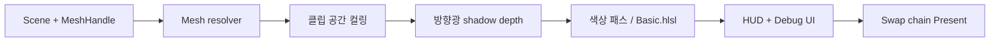

# DirectX 11 렌더링 파이프라인

이 문서는 REMI 0.11.0의 **실제 구현**을 설명한다. 코드 기준점은 `engine/src/render/Renderer.cpp`, `engine/src/render/SceneRenderer.cpp`, `shaders/Basic.hlsl`이다. 렌더러는 D3D feature level 11.0, HLSL shader model 5.0, Windows swap chain을 사용한다.

## 초기화와 데이터

`Renderer`는 D3D11 디바이스·즉시 컨텍스트, flip-discard swap chain, sRGB render-target view, depth/stencil buffer를 생성한다. HLSL의 `VSMain`과 `PSMain`을 컴파일하고 POSITION/COLOR/NORMAL 입력 레이아웃을 만든다. Vertex는 위치·정점 색·노멀을 각각 float3로 갖는다. Static mesh는 immutable vertex/index buffer, 애니메이션 mesh는 CPU가 `Map(WRITE_DISCARD)`으로 갱신하는 dynamic vertex buffer를 사용한다.

`DrawScene`은 각 보이는 MeshComponent의 월드 행렬을 구하고, 메시 핸들을 해결한 뒤 프러스텀 검사와 draw call을 실행한다. Shadow pass에는 광원 view-projection, color pass에는 카메라 view-projection을 전달한다. Static mesh는 로컬 AABB의 여덟 모서리를 클립 공간으로 보내 컬링한다. Dynamic mesh는 현재 포즈의 경계가 달라지므로 컬링하지 않는다. 이 선택은 잘못 사라지는 문제를 피하지만 큰 장면에서는 성능 비용이 있다.

## 좌표 변환

`Matrix4`는 row-major 저장과 row-vector 곱셈을 사용한다. 로컬→월드→뷰→투영 순서로 `world * viewProjection`을 만들고, HLSL에서는 `mul(float4(position,1), g_ModelViewProjection)`으로 계산한다. 부모 Transform은 자식 로컬 행렬 뒤에 부모 행렬을 곱한다. `BakedAnimation`의 Blender 도구는 Z-up/right-handed 정점을 REMI의 Y-up/left-handed 좌표로 변환하고 삼각형 winding을 뒤집는다.

## 방향광 그림자

`DirectionalShadowMatrix`는 방향광의 시점에서 직교 투영 행렬을 만든다. Shadow pass는 2048×2048 R32 typeless 텍스처의 D32 depth view에 깊이를 기록한다. 픽셀 셰이더는 같은 텍스처의 R32 shader-resource view를 사용한다. 그림자 패스를 시작하기 전 SRV 바인딩을 풀어 DSV/SRV 동시 바인딩 충돌을 피한다. 그림자 패스에서는 픽셀 셰이더를 사용하지 않고 깊이만 출력한다.

Color pass는 광원 클립 좌표를 UV로 변환하고 `SampleCmpLevelZero`를 3×3 위치에서 호출해 PCF 가시도를 구한다. 비교 깊이에 bias를 적용하며 shadow rasterizer에도 depth bias를 둔다. 이는 단일 방향광의 고정 해상도 shadow map이다. Cascade shadow maps, contact shadows, 동적 해상도 선택은 없다.

## 색상 패스와 화면 표시

`BeginFrame`은 sRGB render target과 depth buffer를 바인딩·초기화한다. `DrawLitPrepared`가 객체별 월드/MVP/광원/재질 값을 constant buffer에 기록한다. HLSL은 정점 색과 방향광 확산광, ambient, 간이 sky fill, 하이라이트, 그림자 가시도를 조합한다. 노멀 없는 도형은 화면 미분으로 face normal을 계산한다. 자세한 수식과 제약은 [ShaderImplementation.md](ShaderImplementation.md)에 있다.

게임은 색상 장면 뒤에 Pretendard HUD와 디버그 UI를 그린 뒤 `Present`한다. HUD는 독립적인 UI 프레임워크가 아니라 현재 renderer의 메시 경로를 이용한다. Backbuffer 읽기는 스크린샷·진단 시에만 실행하며 일반 프레임 경로에서는 수행하지 않는다.

## 계측과 검증

CPU profiler는 physics/shadow/color/present 구간을 측정한다. GPU는 timestamp/disjoint query 네 세트를 순환하며, 결과가 준비되지 않으면 기다리지 않고 샘플을 건너뛴다. `REMIGravity --profile-csv <파일> --profile-frames <N>`으로 프레임별 CSV를 만들 수 있다. 비교 시 해상도, 하드웨어/WARP, VSync, 빌드 설정과 같은 조건을 고정해야 한다. GPU 결과의 `gpu_valid`를 확인한 뒤 유효한 샘플만 집계한다.

현재 렌더러는 하나의 forward color pass와 하나의 shadow pass를 사용한다. IBL, PBR BRDF, HDR tone mapping, texture sampling, transparency sorting, TAA와 콘솔 백엔드는 구현되지 않았다. 이 범위를 명시해 이미지 결과와 엔진 기능을 혼동하지 않도록 한다.
